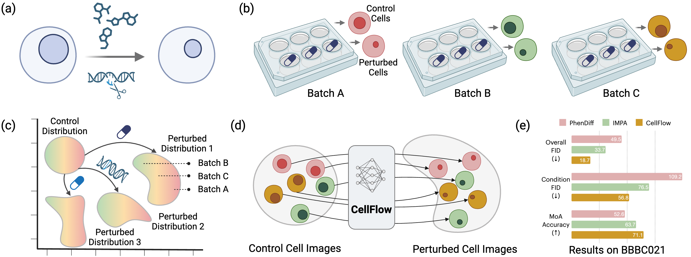
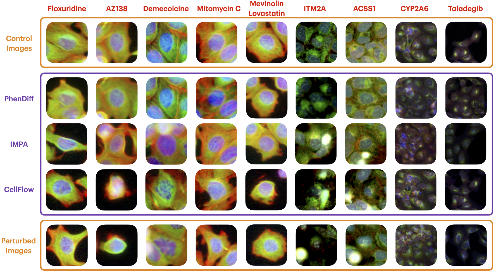
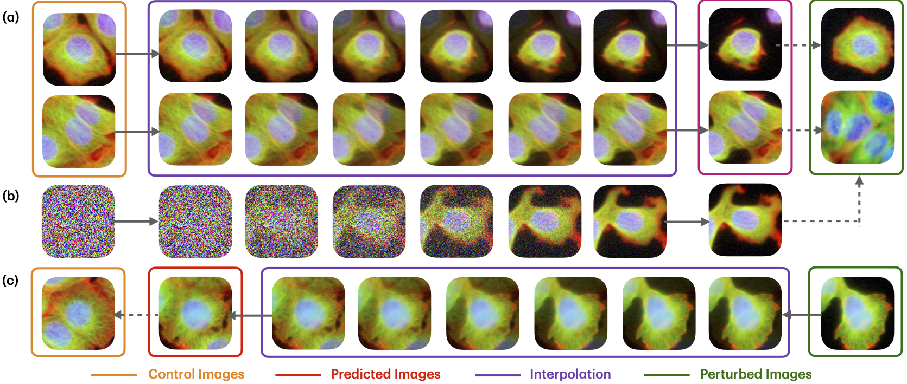

# CellFlux: Simulating Cellular Morphology Changes via Flow Matching

⚠️⚠️⚠️**Repo Under Construction**⚠️⚠️⚠️

[](https://lbesson.mit-license.org/)
[](https://www.python.org/downloads/release/python-311/)
[](https://pytorch.org/get-started/previous-versions/#v25)
[](https://github.com/ambv/black)

This repo provides the PyTorch source code of our paper: [CellFlux: Simulating Cellular Morphology Changes via Flow Matching](https://arxiv.org/pdf/2502.09775) (ICML 2025).

## 🔮 Abstract

Building a virtual cell capable of accurately simulating cellular behaviors in silico has long been a dream in computational biology. We introduce CellFlux, an image-generative model that simulates cellular morphology changes induced by chemical and genetic perturbations using flow matching. Unlike prior methods, CellFlux models distribution-wise transformations from unperturbed to perturbed cell states, effectively distinguishing actual perturbation effects from experimental artifacts such as batch effects—a major challenge in biological data. Evaluated on chemical (BBBC021), genetic (RxRx1), and combined perturbation (JUMP) datasets, CellFlux generates biologically meaningful cell images that faithfully capture perturbation-specific morphological changes, achieving a 35% improvement in FID scores and a 12% increase in mode-of-action prediction accuracy over existing methods. Additionally, CellFlux enables continuous interpolation between cellular states, providing a potential tool for studying perturbation dynamics. These capabilities mark a significant step toward realizing virtual cell modeling for biomedical research.

</img>
**Overview of CellFlux.**
(a) Objective. CellFlux aims to predict changes in cell morphology induced by chemical or gene perturbations in silico. In this example, the perturbation effect reduces the nuclear size. 
(b) Data. The dataset includes images from high-content screening experiments, where chemical or genetic perturbations are applied to target wells, alongside control wells without perturbations. Control wells provide prior information to contrast with target images, enabling the identification of true perturbation effects (e.g., reduced nucleus size) while calibrating non-perturbation artifacts such as batch effects—systematic biases unrelated to the perturbation (e.g., variations in color intensity). 
(c) Problem formulation. We formulate the task as a distribution-to-distribution problem (many-to-many mapping), where the source distribution consists of control images, and the target distribution contains perturbed images within the same batch. 
(d) Flow matching. CellFlux employs flow matching, a state-of-the-art generative approach for distribution-to-distribution problems. It learns a neural network to approximate a velocity field, continuously transforming the source distribution into the target by solving an ordinary differential equation (ODE). 
(e) Results. CellFlux significantly outperforms baselines in image generation quality, achieving lower Fr´echet Inception Distance (FID) and higher classification accuracy for mode-of-action (MoA) predictions.


## 🛠️ CellFlux Methods

Use ```bash example.sh``` to try our CellFlux methods!

## 💎 Capabilities

CellFlux enables accurate prediction of perturbation response, achieving tate-of-the-art performance on various datasets.
<div align="center">
    
</div>

CellFlux unlocks new capa-bilities such as handling batch effects or visualizing cellular state transitions, significantly advancing the field towards a virtual cell for drug discovery and personalized therapy.
<div align="center">
    
</div>


## 🎯 Citation

If you use this repo in your research, please cite it as follows:
```
@inproceedings{CellFlux,
  title={CellFlux: Simulating Cellular Morphology Changes via Flow Matching},
  author={Zhang, Yuhui and Su, Yuchang and Wang, Chenyu and Li, Tianhong and Wefers, Zoe and Nirschl, Jeffrey and Burgess, James and Ding, Daisy and Lozano, Alejandro and Lundberg, Emma and others},
  booktitle={International Conference on Machine Learning (ICML)},
  year={2025}
}
```